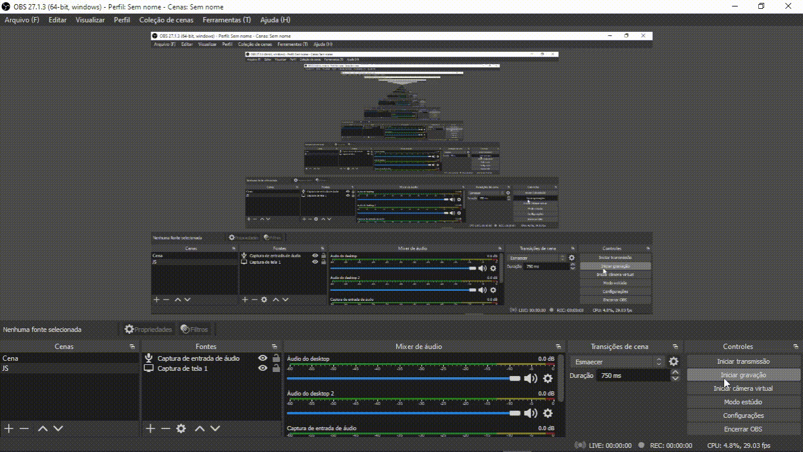

<h1 align="center">
    
🔗 Projeto acender e apagar lâmpada

</h1>

<h3 align="center">🚀 Descrição:</h3>

    Sisteminha para acender e apagar uma lampada com javaScript.

	<h3 style="font-weight: normal;" align="center">🛠 Tecnologias:</h3>

    
    
    

<h3 style="font-weight: normal;" align="center">🚀 Como usar:</h3>

  Você pode visualizar o projeto baixando e rodando o index.html ou no meu portfólio.

	    

<h3 align="center"> 
	🚧  Status do Projeto:  Finalizado!  🚧
</h3>

<h3 align="center"> 🚀 Demostração da página</h3>

    

										     

										     
<h3 align="center">🚀 Agradecimentos:</h3>
		  

Obrigado por está interessado nos meus sistemas, espero que de alguma forma eu possa
ajudar você nos seus estudos, e que possa aproveitar algo de bom aqui!   
Meu linkedin: Breno Nicácio 
 
Meu Portfólio: brenonicacio.com.br
  	   

		  

	   

      

MIT License
@Copyright (c) 2021 Breno Nicácio

